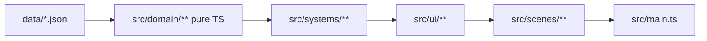

# Repository Guidelines

## Project Overview

**Exogen** is a Phaser 4 + TypeScript sci-fi dungeon-crawler card game. The canvas is 270×480 portrait pixel-art (`pixelArt: true`, FIT scaling) — all coordinates and font sizes assume this tiny resolution. Content and balance live in `src/data/*.json`; game logic is pure TypeScript in `src/domain/`; Phaser is UI-only.

The canonical setting is defined in [`docs/EXOGEN_WORLD_BIBLE.md`](docs/EXOGEN_WORLD_BIBLE.md). Player-facing content must respect its canon hierarchy, the year 3874 / 233 d.O., Sol Civilis terminology, bidirectional portals, Exogenous Drift, context dependence, and the hidden posthuman origin of the network. Do not reveal reserved truths directly in early in-world material.

## Architecture & Data Flow

Layered architecture — dependencies point one way:

- **`src/data/*.json`** — static content (cards, enemies, affixes, skill tree). Imported directly as modules (`resolveJsonModule`), never fetched.
- **`src/domain/**`** — pure, Phaser-free game logic: combat, cards, enemies, map gen, progression, items. ALL tests target this layer. Keep it Phaser-free.
- **`src/systems/**`** — singleton services: `SaveSystem`, `AudioSystem` (synthesized WebAudio SFX), `Device`, `bindSceneKeys`.
- **`src/ui/**`** — reusable Phaser widgets (`CardSprite`, `HealthBar`, `BackButton`, `ConfirmModal`, `DamageNumbers`, `pixelText`).
- **`src/scenes/`** — 19 Phaser scenes; the only layer that mutates `RunState` and owns timers/tweens.

**State flow:**
- `RunState` (`src/domain/progression/RunState.ts`, plain-field class) is the single run save object, passed between scenes via `scene.start(name, { runState })` and read with `getRunState()` (`src/debug.ts`).
- `SaveSystem` (`src/systems/SaveSystem.ts`) serializes to `localStorage` (prefix `exogen_save_`, versioned, currently `version: 9`) with hand-written legacy migrations; legacy `dnd_save_*`/`dnd_meta_v1` keys (pre-rename, dice-and-depths) are moved over on first access. **Any new persisted RunState field needs serialize + deserialize + version updates.**
- `MetaProgression` owns cross-run meta (gold, decks, collection, skill tree), loaded once in `main.ts`.

**Combat flow:** `CombatScene` mirrors mutable state (`this.enemy`, `this.state.hp/heroShield/heroPoison`), converts to `CombatFighter` via `toFighter()`, calls `CombatEngine.resolvePlayerTurn(...)`, copies results back. All card math has exactly one path — `previewCards`/`previewCardsVs`/`resolveCardPlays` in `src/domain/cards/CardEffects.ts` — so preview cannot diverge from application.

**Card-effect die:** pure module `src/domain/combat/CardEffectDie.ts` (`rollCardEffectDie(rng)`: faces 1–3→×1, 4–5→×2, 6→×3, clamps rng). The multiplier threads through `CardPlayBonuses.cardEffectMultiplier` and applies ONLY to printed card values (after fusion scaling); `elementDmgBonus`, `poisonAmp`, `bonusDmgFlat`, `heavy_hit` stay additive and un-multiplied. Enemy HP is compensated at exactly one point: `Enemy.forNode()` wraps generated HP with `compensateEnemyHpForCardDie` (ceil ×1.6). `CombatScene` runs a phase machine (`idle/awaiting/rolling/decision`, max 2 rolls — one reroll) and reuses the preview row for the pixel die UI.

## Key Directories

| Path | Purpose |
|---|---|
| `src/main.ts` | Phaser bootstrap; every scene MUST be registered in the `scene:` array |
| `src/domain/` | Pure game logic (all tests target this) |
| `src/data/*.json` | Content/balance tables |
| `src/scenes/` | Phaser scenes (UI only, drive domain logic) |
| `src/systems/` | Audio, save, device, key binding |
| `src/ui/` | Reusable Phaser display objects |
| `src/i18n/` | Typed locales; `es.ts` is source of truth |
| `tests/` | Vitest unit tests (repo root, outside `src/`) |
| `scripts/` | `balance-sim.mjs` (only script) |

Dead leftovers — do NOT build on: `src/domain/dice/`, `src/systems/RngService.ts`, `src/ui/panels/`, empty `src/data/bosses.json|characters.json|events.json|items.json`.

## Development Commands

- `pnpm dev` — vite dev server (port 5173)
- `pnpm test` — `vitest run` (node env, `tests/**/*.test.ts`)
- `pnpm test tests/Deck.test.ts` — single test file
- `pnpm build` — `tsc && vite build`; **this is also the typecheck** (tsc `noEmit`, no separate typecheck script)
- `pnpm test:watch` — vitest watch mode
- `node scripts/balance-sim.mjs [runs]` — Monte Carlo pacing check (optional run count, default 200)
- `docker-compose up dev` — container dev (8080→5173, Traefik at `ex.surfingbird.space`, needs external `service_network`; vite `allowedHosts` is already set)

**No lint/formatter is configured — don't invent one.**

## Code Conventions & Common Patterns

- **TypeScript:** `verbatimModuleSyntax` (type-only imports MUST use `import type`), `erasableSyntaxOnly` (no enums, namespaces, or constructor parameter properties), `noUnusedLocals`/`noUnusedParameters`. `strict` is NOT set — don't rely on strict null checks.
- **i18n:** default locale is `es`. `TranslationKey` is `keyof typeof es`, so **add new strings to `src/i18n/locales/es.ts` first or they won't typecheck**, then mirror in `en.ts`. Missing keys fall back to es, then the raw key. Use `t(key, {vars})` for `{placeholder}` interpolation; `tKey(dynamicId, fallback)` for id-derived strings (gear.*, card.*, enemy.*…).
- **Pixel text:** all UI text goes through `addPixelText`/`pixelTextStyle` (`src/ui/pixelText.ts`) — Silkscreen is crisp only at 8px/16px (font sizes snap), resolution 2, NEAREST filter, no synthetic bold.
- **Keyboard:** per-scene via `bindSceneKeys(this, { 'keydown-ESC': …, 'keydown-ENTER': … })`.
- **Audio:** `AudioSystem.play('select'|'dice'|'attack'|…)`; WebAudio unlocks on first pointer gesture in `main.ts`.
- **Reduced motion:** `preferReducedMotion()` (`src/systems/Device.ts`) halves combat animation durations on touch/mobile.
- **Determinism:** gameplay randomness takes an injectable `rng: () => number` (see `rollCardEffectDie`, `Enemy.forNode` seeds) — never call `Math.random()` directly in domain code.
- **CombatScene** (1274 lines) schedules KO/enemy turns via `this.time.delayedCall(400/450, …)` — preserve these orderings when editing turn flow.
- **Docs language:** `TODO.md` (backlog) is in Spanish; code and this file are English.

## Important Files

- `src/main.ts` — entrypoint, scene registry, debug shortcuts: **Ctrl+1–8** jump to scenes with a debug state, **Ctrl+S/L** quicksave/load, **Ctrl+0/R** menu. Keep these working when touching entrypoint code.
- `src/config.ts` — `PIXEL_FONT='Silkscreen'`, `COMBAT_FONT='VT323'`, 270×480.
- `src/debug.ts` — `createDebugState(floor)`, `getRunState`, scene-data helpers.
- `src/domain/cards/CardEffects.ts` — single card-math path; `COMBAT_RESIST_CAP = 50`.
- `src/domain/combat/CombatEngine.ts` / `CardEffectDie.ts` — turn resolution; die roll + HP compensation.
- `src/domain/enemies/Enemy.ts` — `Enemy.forNode` is the only runtime HP generation.
- `src/systems/SaveSystem.ts` — versioned persistence with legacy migrations.
- `src/i18n/locales/es.ts` — locale source of truth (`TranslationKey`).
- `scripts/balance-sim.mjs` — mirrors domain constants (Packs, Fusion, Card, CombatRewards, Enemy, CardEffectDie); **header says "keep constants in sync" — any balance change in those files requires manually re-syncing this script**. It's a pacing sanity check, not an exact simulation of waves/echoes/defense.

## Runtime/Tooling Preferences

- **Package manager:** pnpm **11.5.1**, pinned via `packageManager` (corepack). Use `pnpm install --frozen-lockfile` in CI/docker. Do not use npm/yarn/bun.
- **Runtime:** Node for tooling (Vite 8, TypeScript 6, Vitest 4); the game itself runs in the browser via Phaser 4.2.
- **ESM:** `"type": "module"` throughout.
- **tsconfig** includes only `src/` — tests are type-checked by vitest, not tsc.
- **Docker:** `Dockerfile.dev` (node:22-alpine) + `docker-compose.yml`; dev-server-only deployment behind Traefik. `CHOKIDAR_USEPOLLING=true` for HMR in containers.

## Testing & QA

- **Framework:** Vitest 4, node environment (`vitest.config.ts`: `tests/**/*.test.ts`, setup `tests/setup.ts`).
- **Setup:** `tests/setup.ts` installs a Map-backed `localStorage` stub, cleared in a global `beforeEach` — `SaveSystem` tests depend on it.
- **Conventions:**
  - Tests import `describe/it/expect` from `vitest` explicitly; exercise `src/domain/**` as pure TS only.
  - Determinism: inject RNG (`rollCardEffectDie(() => sample)`), use seeded factories, call `resetCardIds()` before `makeRunCard` so instance ids don't leak.
  - Use `tests/helpers.ts` `makeState(seed)` for `RunState` fixtures.
  - Avoid fragile snapshots of randomized HP — compare aggregates with ratio assertions (see `tests/EnemyThresholds.test.ts`).
  - Respect pinned behavior: heal caps at `maxHp`, combat resist caps at 50, poison ignores resist, and additive bonuses (`elementDmgBonus`, `poisonAmp`, `bonusDmgFlat`, `heavy_hit`) are deliberately NOT multiplied by `cardEffectMultiplier`.
- **QA gate:** `pnpm test` + `pnpm build`. Phaser scenes have ZERO automated coverage — verify UI manually via `pnpm dev` + `Ctrl/Cmd+2` (debug combat).
- **Balance QA:** `node scripts/balance-sim.mjs 1` — combat pacing table (base vs dado columns) plus collection max-out Monte Carlo.
